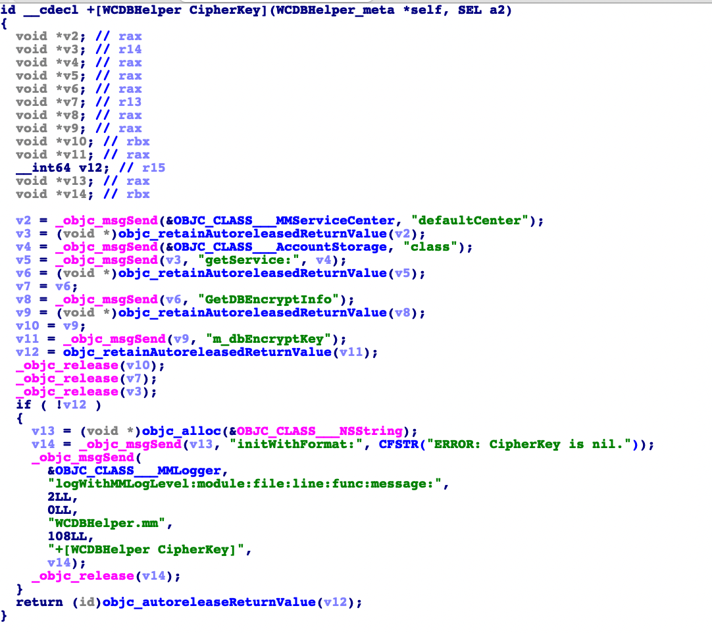

# mac端wxapkg解密

免责条款
========

本代码只用于个人技术研究交流使用，不得用于商业用途。

## 2022.6.4 update

[issue](https://github.com/TinyNiko/mac_wxapkg_decrypt/issues/1) 中提到，小程序的 key 跟数据库加密的 key 是同一个，我分析了一下发现这个 key 是通过请求获取的，也就是说我们并没有办法分析到key的生成逻辑。

## 说明

致敬[BlackTrace/pc_wxapkg_decrypt](https://github.com/BlackTrace/pc_wxapkg_decrypt)。 同样是不想用移动端提取wxapkg, 所以分析了一下mac端的解密逻辑。该项目是把wxapkg解密。当前支持的微信MAC版本为： **[3.4.0, 3.8.0)**。 暂不支持 **3.8.0**, 整个逻辑都不一样了，需要重新分析。

## 使用方法

由于解密过程需要使用**frida**， 首先第一步就是关闭macos的SIP, 这个可以自行搜索。

我提供了2种解密的方法， 一种是提取解密用的key， 一种是直接让小程序帮我们解密。

如果你使用第一种，那么在提取key 之后，需要修改 `decpkg.py`中的key。 如果是第二种，那么就需要确认小程序所在的目录了，然后将文件输入输出路径写到 `_agent.js`中，第二种方法涉及到文件读写，提供的路径必须是小程序可读写的目录。

Mac小程序的路径在 `~/Library/Group Containers/xxxx.com.tencent.xinWeChat/Library/Caches/xinWeChat/4xxxxxxxx/WeApp/LocalCache/release/ `

在你修改好_agent.js 之后，就可以开始hook了。

打开任意一个微信小程序， 通过ps -ef | grep Mini 找到小程序的 pid， 这里会出现2个小程序，随便选一个就行，然后

> frida pid -l _agent.js

如果是 `way 1` ,日志会删除32个字节的key， 你只要提取前16个字节即可。

如果是 `way 2`, 则会有一个解密后的文件产生。

解密完成后，就可以用wxappUnpacker（[https://github.com/gudqs7/wxappUnpacker）解包了。](https://github.com/gudqs7/wxappUnpacker%EF%BC%89%E8%A7%A3%E5%8C%85%E4%BA%86%E3%80%82)

## 原理

Mac加密方法比较简单， 取wxapkg的前1024个字节，通过 AES_ECB 进行加密， 加密的 key 来自于微信主程序，由于我没有逆向 key 的生成逻辑，目前只能怀疑 key 是 **m_dbEnryptKey**

不过就算我们不知道key的生成逻辑，只要有这个key就够了。

~~最后，如果有同学想逆向key逻辑的，欢迎交流。~~
